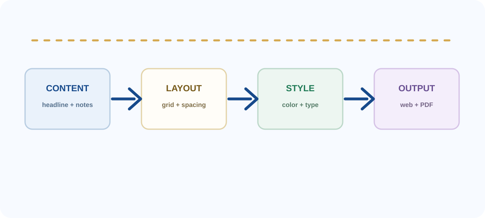
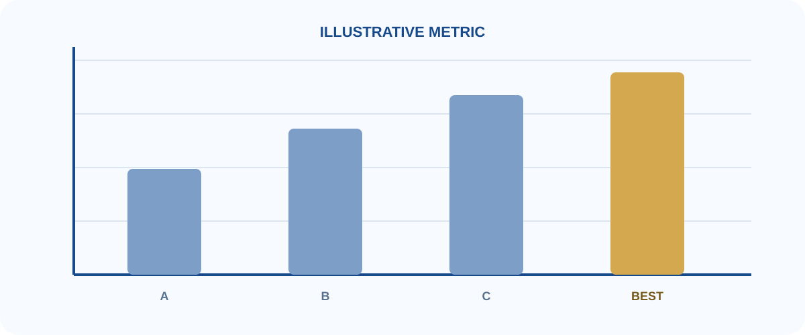
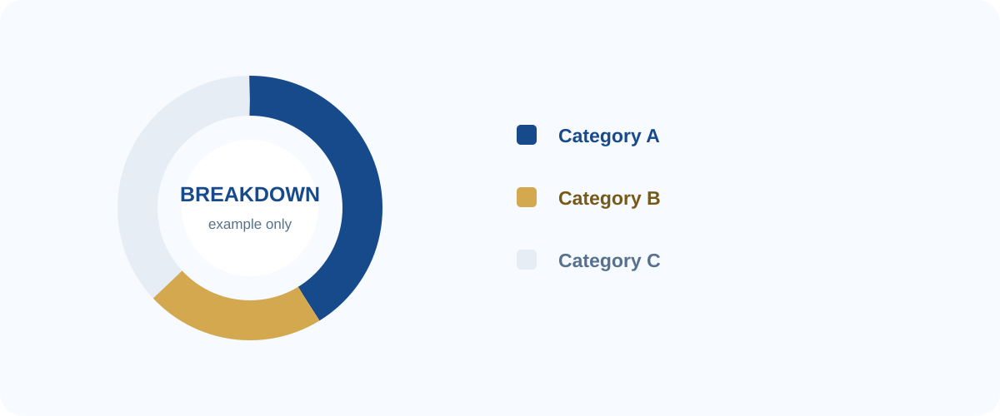
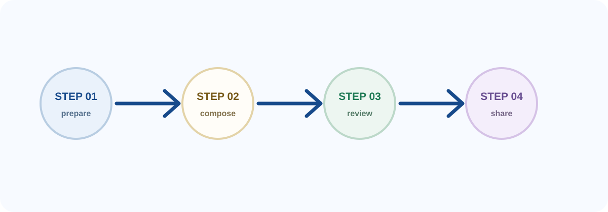
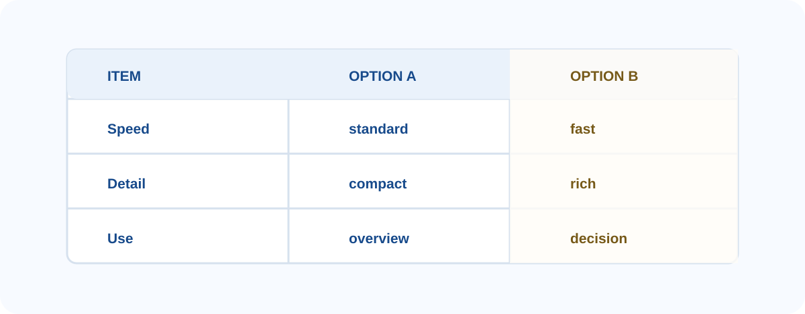

  
  

    
浙江大学 · Reveal-md Template

    <h1 class="cover-title">标题占位符 与容器使用示例</h1>
    

    
用一页说明主题、目的或结论

    
汇报人：姓名占位符

    
学院 / 方向：信息占位符

    
日期：YYYY 年 MM 月 DD 日

  

<!--s-->

  <h2 class="page-title">容器目录</h2>
  

    
01

    
基础布局与信息容器

    
02

    
图片、图表与卡片容器

    
03

    
流程、表格与验证容器

  

  
每页只展示一组相关容器；复制结构后替换文字和图片即可。

<!--s-->

  
01 基础布局 · Basic Layout

  

    
基础信息容器

    
封面、目录、分割页和信息卡片是所有页面的基础。

  

<!--v-->

  <h2 class="page-title">1.1 个人信息容器</h2>
  

    

      
      

        
姓名占位符

        
浙江大学 · 学院占位符 专业 / 方向占位符

      

    

    

      

        

01

数据标签

        

02

数据标签

        

03

数据标签

      

      

        
要点标签

        <ul class="tag-list">
          <li class="tag-list__item">示例标签一</li>
          <li class="tag-list__item">示例标签二</li>
          <li class="tag-list__item">示例标签三</li>
          <li class="tag-list__item">示例标签四</li>
        </ul>
      

      

        
补充信息

        <ul class="bullet-list">
          <li class="bullet-list__item">经历、荣誉或关键词</li>
          <li class="bullet-list__item">每条内容保持简短清晰</li>
          <li class="bullet-list__item">不需要的条目可以删除</li>
        </ul>
      

    

  

<!--v-->

  <h2 class="page-title">1.2 双栏信息卡片</h2>
  

    
模块标题占位符

    
副标题 / 时间 / 标签

  

  

    

      
内容模块 A

      
用一句话说明这个模块要解决的问题。

      
<b>重点：</b>填写三到五个关键词。

      
<b>说明：</b>补充背景、方法或结果。

      
标签 A标签 B标签 C

    

    

      
内容模块 B

      
用一句话描述另一个并列模块。

      
<b>输入：</b>信息或资源占位符。

      
<b>输出：</b>结论或交付物占位符。

      
状态时间

    

  

  

    

关键词 A

一句简短解释。

    

关键词 B

一句简短解释。

    

关键词 C

一句简短解释。

  

<!--s-->

  
02 视觉组件 · Visual Components

  

    
图片与图表容器

    
图片只保留抽象示例，替换时请同时更新说明和结论。

  

<!--v-->

  <h2 class="page-title">2.1 图片说明容器</h2>
  

    

      

        
图片使用方式

        
<b>文件</b>放入 assets 文件夹

        
<b>引用</b>使用相对路径

        
<b>说明</b>补充一句结论

      

      
从图片到观点

      

        
排版提示

        
<b>避免</b>图片占满页面却没有重点

        
<b>推荐</b>保留留白并突出关键信息

      

    

    

      
      
Input → Context → Output

    

  

  
每张图都应该服务于一个明确观点；不能帮助读者理解的图片可以删掉。

<!--v-->

  <h2 class="page-title">2.2 三列任务卡片</h2>
  

    

      

基础

01

      
放置一个短例子

      
补充一行上下文。

      
说明这一列想表达的核心观点。

    

    

      

重点

02

      
突出一个关键词

      
用两行文字解释，不堆叠完整段落。

      
说明读者应该记住什么。

    

    

      

行动

03

      
给出下一步

      
说明时间、负责人或预期结果。

      
把信息转化成明确的行动。

    

  

  

    
03Cards

    
01Key Point

    
02Next Steps

  

  

    
<b>标题</b>告诉读者这张卡片的主题。

    
<b>例子</b>用一个具体但不敏感的例子支撑观点。

    
<b>结论</b>用一句话收束卡片内容。

  

<!--v-->

  <h2 class="page-title">2.3 图片与图表框架</h2>
  

  
框架图容器：使用一张图说明结构，再用一句话解释阅读顺序。

<!--v-->

  <h2 class="page-title">2.4 数据图表容器</h2>
  

  
图表中的数字仅用于展示排版方式；替换时请同步更新标题、单位、图例和结论。

<!--v-->

  <h2 class="page-title">2.5 分析图容器</h2>
  

  
分析图容器适合展示构成、分布或类别之间的关系。

<!--s-->

  
03 结构化表达 · Structured Story

  

    
流程、表格与验证

    
复杂内容拆成顺序、对比和判断，读者会更容易跟上。

  

<!--v-->

  <h2 class="page-title">3.1 流程步骤容器</h2>
  

    

      
1
准备背景与输入信息

      
2
组合内容并突出重点

      
3
检查结构并输出结论

    

    

      

        
流程说明

        
步骤容器适合表达严格的先后顺序，每步只保留一个动作。

      

      

        
        
图片可以作为流程的辅助说明。

      

    

  

  
如果节点没有顺序关系，就改用卡片、矩阵或对比表。

<!--v-->

  <h2 class="page-title">3.2 对比表容器</h2>
  

    

      
信息对比示例

      <table class="comparison-table">
        <thead><tr><th>项目</th><th>选项 A</th><th>选项 B</th></tr></thead>
        <tbody>
          <tr><td>速度</td><td>标准</td><td>快速</td></tr>
          <tr><td>细节</td><td>紧凑</td><td>丰富</td></tr>
          <tr><td>适用</td><td>概览</td><td>决策</td></tr>
        </tbody>
      </table>
    

    

      
对比图示例

      
    

  

  
对比表只保留会影响决策的维度，并用颜色强调推荐选项。

<!--v-->

  <h2 class="page-title">3.3 验证与结论容器</h2>
  
<b>核心想法</b>先提出一个可验证的判断，再用简短证据支持或修正它。

  

    

      

        
Input

        
背景信息与当前问题 <b>明确验证对象</b>

        
<b>Evidence</b> 列出一条关键证据

      

      

        
Output

        
支持、反对或待确认 <b>写出结论</b>

        
<b>Next</b> 给出下一步行动

      

    

    

      <table class="verify-table">
        <thead><tr><th>项目</th><th>示例</th><th>状态</th></tr></thead>
        <tbody>
          <tr><td>判断</td><td>目标清晰</td><td>通过</td></tr>
          <tr><td>证据</td><td>信息完整</td><td>通过</td></tr>
          <tr><td>下一步</td><td>补充细节</td><td>待办</td></tr>
        </tbody>
      </table>
    

  

  
结论占位符：用一句话总结最重要的发现，避免重复整页内容。

<!--s-->

  

    
感谢阅读

    
Q&amp;A

  

