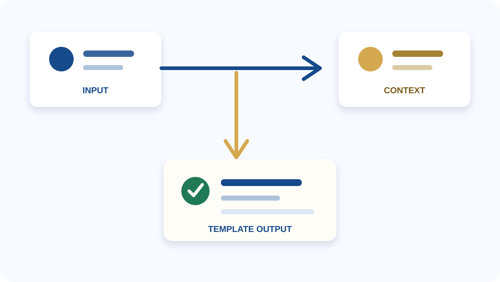

---
title: ZJU reveal-md template
separator: <!--s-->
verticalSeparator: <!--v-->
theme: simple
highlightTheme: github
css: custom.css
katex: true
revealOptions:
    transition: 'slide'
    transitionSpeed: fast
    center: false
    slideNumber: "c/t"
    width: 1200
---

  
  

    
浙江大学 · Reveal-md Template

    <h1 class="cover-title">标题占位符 与容器使用示例</h1>
    

    
用一页说明主题、目的或结论

    
汇报人：姓名占位符

    
学院 / 方向：信息占位符

    
日期：YYYY 年 MM 月 DD 日

  

<!--s-->

  <h2 class="page-title">容器目录</h2>
  

    
01

    
基础布局与信息容器

    
02

    
页面布局与媒体容器

    
03

    
流程、表格与验证容器

  

  
每页只展示一组相关容器；复制结构后替换文字和图片即可。

<!--s-->

  
01 基础布局 · Basic Layout

  

    
基础信息容器

    
封面、目录、分割页和信息卡片是所有页面的基础。

  

<!--v-->

  <h2 class="page-title">1.1 个人信息容器</h2>
  

    

      
      

        
姓名占位符

        
浙江大学 · 学院占位符 专业 / 方向占位符

      

    

    

      

        

01

数据标签

        

02

数据标签

        

03

数据标签

      

      

        
要点标签

        <ul class="tag-list">
          <li class="tag-list__item">示例标签一</li>
          <li class="tag-list__item">示例标签二</li>
          <li class="tag-list__item">示例标签三</li>
          <li class="tag-list__item">示例标签四</li>
          <li class="tag-list__item">示例标签五</li>
          <li class="tag-list__item">示例标签六</li>
        </ul>
      

      

        
补充信息

        <ul class="bullet-list">
          <li class="bullet-list__item">经历、荣誉或关键词</li>
          <li class="bullet-list__item">每条内容保持简短清晰</li>
          <li class="bullet-list__item">不需要的条目可以删除</li>
          <li class="bullet-list__item">第四个方框</li>
          <li class="bullet-list__item">第五个方框</li>
          <li class="bullet-list__item">第六个方框</li>
        </ul>
      

    

  

<!--v-->

  <h2 class="page-title">1.2 双栏信息卡片</h2>
  

    
模块标题占位符

    
副标题 / 时间 / 标签

  

  

    

      
内容模块 A

      
用一句话说明这个模块要解决的问题。

      
<b>重点：</b>填写三到五个关键词。

      
<b>说明：</b>补充背景、方法或结果。

      
标签 A标签 B标签 C

    

    

      
内容模块 B

      
用一句话描述另一个并列模块。

      
<b>输入：</b>信息或资源占位符。

      
<b>输出：</b>结论或交付物占位符。

      
状态时间

    

  

  

    

关键词 A

一句简短解释。

    

关键词 B

一句简短解释。

    

关键词 C

一句简短解释。

  

<!--s-->

  
02 视觉组件 · Visual Components

  

    
页面布局与媒体容器

    
先选择页面结构，再把文字、表格或图片放入对应区域。

  

<!--v-->

  <h2 class="page-title">2.1 媒体容器</h2>
  

    

      

        
图片使用方式

        
<b>文件</b>放入 assets 文件夹

        
<b>引用</b>使用相对路径

        
<b>替换</b>保留 alt 文本并同步更新说明

      

      

        
配文方式

        
<b>标题</b>说明图片展示的对象

        
<b>图注</b>补充读者需要关注的结论

      

    

    

      
      
一张图对应一个观点，图片下方保留一句说明。

    

  

  
框架图、数据图表和分析图都可以复用这个媒体容器，不需要为每种图片单独建立一套页面。

<!--v-->

  <h2 class="page-title">2.2 上下布局结构</h2>
  

    

      
图片 / 图表区域

      
assets/example.svg

    

    

      
<b>01 内容</b>标题和核心信息

      
<b>02 证据</b>一个关键数字或观察

      
<b>03 解释</b>一句话说明原因

      
<b>04 结论</b>读者应该记住的内容

    

  

  
上方放一块主视觉区域，下方用四个同宽要点补充阅读线索。把图片替换进去即可恢复原始的“上图下卡片”结构。

<!--v-->

  <h2 class="page-title">2.3 左右布局结构</h2>
  

    

      
LEFT · CONTEXT

      
背景与输入

      
放置问题、限制条件或已有信息。

      
正文保持短句，避免挤压右侧重点。

    

    

      
RIGHT · OUTPUT

      
结果与结论

      
放置一条观察、一个结论或下一步。

      
用金色强调需要读者带走的信息。

    

  

  
左右布局适合表达“背景—结果”“问题—回答”或“方法—结论”等关系。

<!--v-->

  <h2 class="page-title">2.4 三栏布局结构</h2>
  

    

      

基础

01

      
放置一个短例子

      
补充一行上下文。

      
说明这一列想表达的核心观点。

    

    

      

重点

02

      
突出一个关键词

      
用两行文字解释，不堆叠完整段落。

      
说明读者应该记住什么。

    

    

      

行动

03

      
给出下一步

      
说明时间、负责人或预期结果。

      
把信息转化成明确的行动。

    

  

  

    
03Cards

    
01Key Point

    
02Next Steps

  

  

    
<b>输入</b>交代背景、约束或已有信息。

    
<b>重点</b>突出读者最需要记住的一条判断。

    
<b>输出</b>用一句结论承接到下一页。

  

<!--v-->

  <h2 class="page-title">2.5 复合布局结构</h2>
  

    

      

        
主内容区域

        
标题 / 背景 / 关键说明

      

      

        
<b>输入</b>先交代读者需要知道的背景。

        
<b>判断</b>突出页面最重要的一条观察。

        
<b>输出</b>用一句结论承接到下一页。

      

    

    

      

侧栏提示

放置定义、口径或补充信息。

      

视觉重点

用颜色和留白建立阅读顺序。

    

  

  
复合布局把主内容、侧栏提示和底部结论放在同一页，适合内容较多但层级清晰的页面。

<!--v-->

  <h2 class="page-title">2.6 框架图容器</h2>
  

    

      
    

    

      
<b>① 输入模块</b>上下文或数据占位符。

      
<b>② 处理模块</b>方法或系统说明占位符。

      
<b>③ 交互模块</b>对象或运行场景占位符。

      
<b>④ 输出模块</b>结果或下一步占位符。

    

  

  
先用图片展示整体结构，再用四个说明项解释模块职责；替换图片即可复用。

<!--s-->

  
03 结构化表达 · Structured Story

  

    
流程、表格与验证

    
复杂内容拆成顺序、对比和判断，读者会更容易跟上。

  

<!--v-->

  <h2 class="page-title">3.1 流程示例占位符</h2>
  

    

起点占位

输入信息占位符

    
→

    

任务占位

任务描述占位符

    
→

    

候选结果

输出内容占位符

    
→

    

验证步骤

判断说明占位符

  

  

    

      
研究背景

      
研究背景或页面引导语占位符。

      
<b>输入</b>输入内容占位符

      
<b>难点</b>问题描述占位符

      
<b>关键结论占位符。</b> 补充说明占位符。

    

    

      
核心问题

      
研究问题或设计目标占位符。

      
问题补充说明占位符。

    

  

<!--v-->

  <h2 class="page-title">3.2 案例展示占位符</h2>
  

    

      
1
输入资料占位符

      
2
任务描述占位符

      
3
字段整理占位符

      
4
参考信息占位符

      
5
结果输出占位符

    

    

      
Case 展示

      
目标<b>目标描述占位符</b>

      
操作<b>操作说明占位符</b>

      
参考信息占位符

      

        
候选项 A<b>值占位</b><i style="width: 100%;"></i>

        
候选项 B<b>值占位</b><i style="width: 70%;"></i>

        
候选项 C<b>值占位</b><i style="width: 20%;"></i>

      

      
↓

      
输出字段<b>key = value</b><small>结果说明占位符</small>

    

  

  
把输入信息整理成可复用的结果，便于后续容器使用。

<!--v-->

  <h2 class="page-title">3.3 信息流程容器</h2>
  
<b>核心想法</b>页面主说明或方法摘要占位符。

  

    

      

        
Input

        

          
输入标题占位符

          
输入说明占位符

        

        
<b>Evidence</b> 证据说明占位符

      

      

        
Output

        

          
输出标题占位符

          
输出说明占位符

        

        
<b>Next</b> 下一步说明占位符

      

    

    

      
结果示例

      <table class="result-table">
        <thead><tr><th>项目</th><th>示例</th><th>状态</th></tr></thead>
        <tbody>
          <tr><td>条目 A</td><td>内容占位符</td><td class="table-status-cell table-status-cell--green">完成</td></tr>
          <tr><td>条目 B</td><td>补充占位符</td><td class="table-status-cell table-status-cell--gold">待确认</td></tr>
          <tr><td>条目 C</td><td>结果占位符</td><td>状态占位符</td></tr>
        </tbody>
      </table>
    

  

  
结论占位符：用一句话总结最重要的发现，避免重复整页内容。

<!--v-->

  <h2 class="page-title">3.4 结构布局占位符</h2>
  
目标说明占位符<b>模块 / 结构说明</b>

  

    

      <h3>模块 A</h3>
      

输入内容占位符
↓
中间步骤占位符
↓
输出结果占位符

      
<b>Input</b>输入说明占位符

      
<b>Output</b>输出说明占位符

      
<b>Signal</b>反馈信号占位符

    

    

      <h3>模块 B</h3>
      

输入内容占位符
↓
中间步骤占位符
↓
输出结果占位符

      
<b>Input</b>输入说明占位符

      
<b>Output</b>输出说明占位符

      
<b>Signal</b>反馈信号占位符

    

  

<!--v-->

  <h2 class="page-title">3.5 方法展示占位符</h2>
  
<b>核心想法</b>页面主说明或方法摘要占位符。

  

    

      
<b>模块组合</b>主标题后的补充说明占位符

      
方法说明或设计动机占位符。

      

        

          
步骤 A

          
输入内容占位符 <b>生成结果占位符</b>

          
<b>判断结果</b> = 状态占位符 反馈信号占位符

        

        

          
步骤 B

          
读取结果与上下文 <b>判断说明占位符</b>

          
<b>反馈</b> 说明占位符

        

      

    

    

      
<b>结果示例</b>指标 / 维度

      <table class="result-table">
        <thead><tr><th>指标</th><th>方案 A</th><th>方案 B</th></tr></thead>
        <tbody>
          <tr><td>指标一</td><td>数值占位</td><td>数值占位</td></tr>
          <tr><td>指标二</td><td>结果占位</td><td>结果占位</td></tr>
          <tr><td>指标三</td><td>说明占位</td><td>说明占位</td></tr>
        </tbody>
      </table>
    

  

  
页面结论或读者需要记住的要点占位符。

<!--v-->

  <h2 class="page-title">3.6 对比表容器</h2>
  

    

      
信息对比示例

      <table class="comparison-table">
        <thead><tr><th>项目</th><th>选项 A</th><th>选项 B</th></tr></thead>
        <tbody>
          <tr><td>速度</td><td>标准</td><td>快速</td></tr>
          <tr><td>细节</td><td>紧凑</td><td>丰富</td></tr>
          <tr><td>适用</td><td>概览</td><td>决策</td></tr>
        </tbody>
      </table>
    

    

      
阅读规则

      
<b>维度</b>只保留会影响选择的项目。

      
<b>强调</b>用表头和底色突出推荐选项。

      
<b>结论</b>表格下方写出比较结果。

    

  

  
对比表只保留会影响决策的维度，并用颜色强调推荐选项。

<!--v-->

  <h2 class="page-title">3.7 全宽表格容器</h2>
  

    <table class="comparison-table">
      <caption>全宽信息对比示例</caption>
      <thead><tr><th>项目</th><th>维度</th><th>方案 A</th><th>方案 B</th></tr></thead>
      <tbody>
        <tr><td>条目 A</td><td>维度占位符</td><td>内容占位符</td><td>结果占位符</td></tr>
        <tr><td>条目 B</td><td>维度占位符</td><td>补充占位符</td><td>状态占位符</td></tr>
        <tr><td>条目 C</td><td>维度占位符</td><td>说明占位符</td><td>结论占位符</td></tr>
        <tr><td>条目 D</td><td>维度占位符</td><td>备注占位符</td><td>待确认</td></tr>
      </tbody>
    </table>
  

  
全宽表格适合展示多列字段；列数增加时优先缩短文案，而不是压缩字号。

<!--s-->

  

    
感谢阅读

    
Q&amp;A

  

